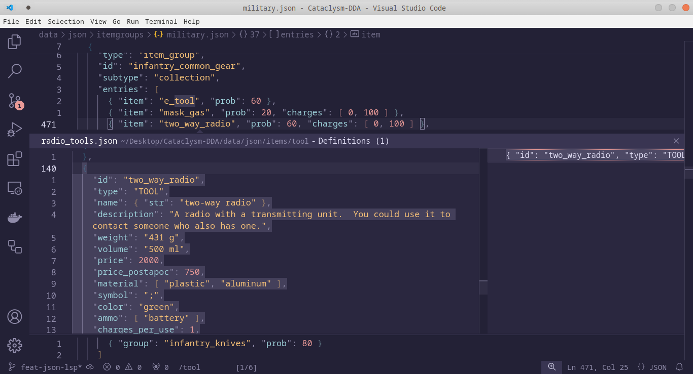
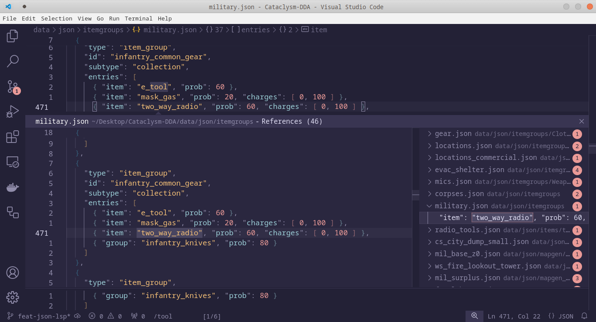

# CDDA JSON language server

Enables "Go to Definition" and "Find References" for the JSON data files of the game [Cataclysm: Dark Days Ahead](https://cataclysmdda.org).

  

  

  

## Developing

- Run `npm install` in this folder. This installs all necessary npm modules in both the client and server folder
- Open VS Code on this folder.
- Press Ctrl+Shift+B / Cmd+Shift+B to compile the client and server.
- Switch to the Debug viewlet.
- Select `Launch Client` from the drop down.
- Run the launch config.
- In the [Extension Development Host] instance of VSCode, open the Cataclysm-DDA source folder.
  - Navigate to a JSON file.
  - Cmd/Ctrl+clicking on IDs in the JSON should jump to definition/find references.
